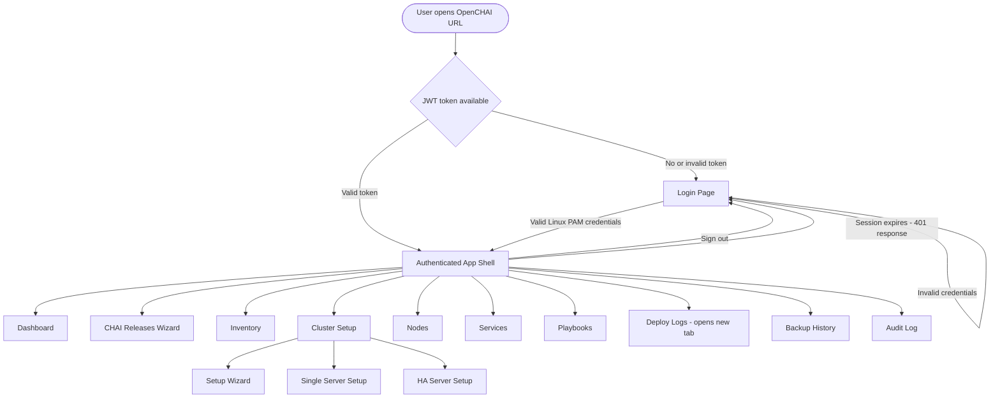
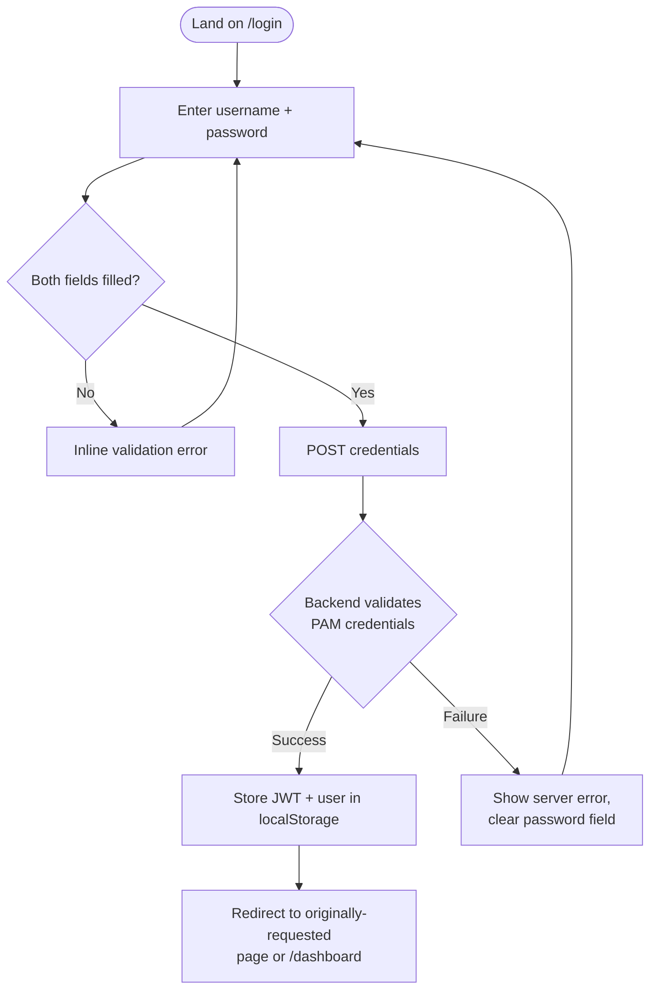
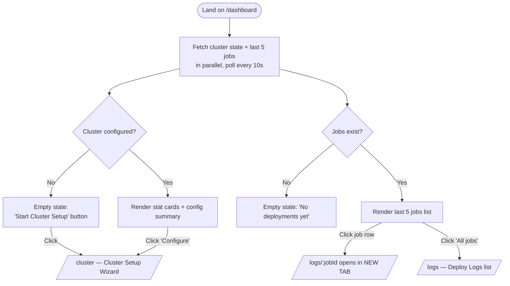
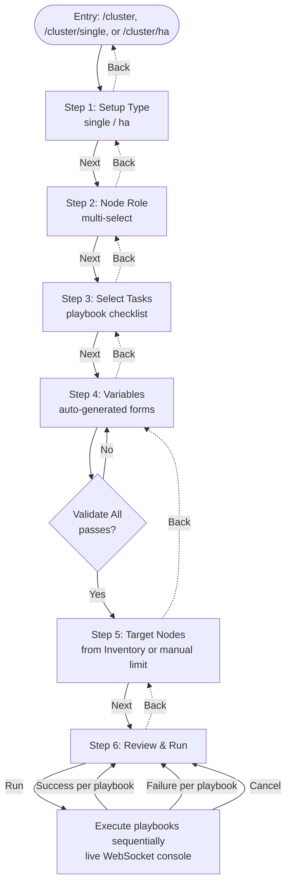
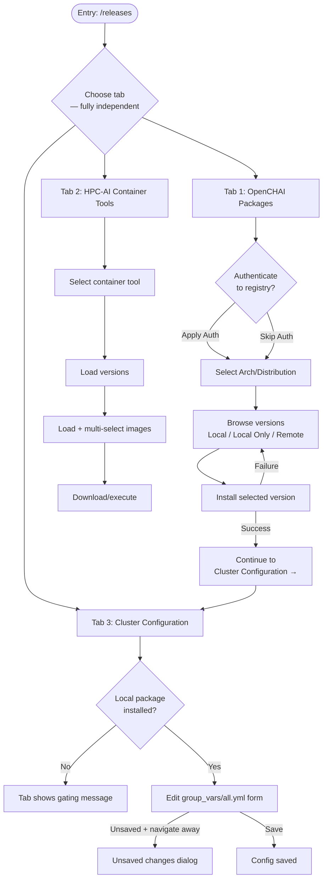
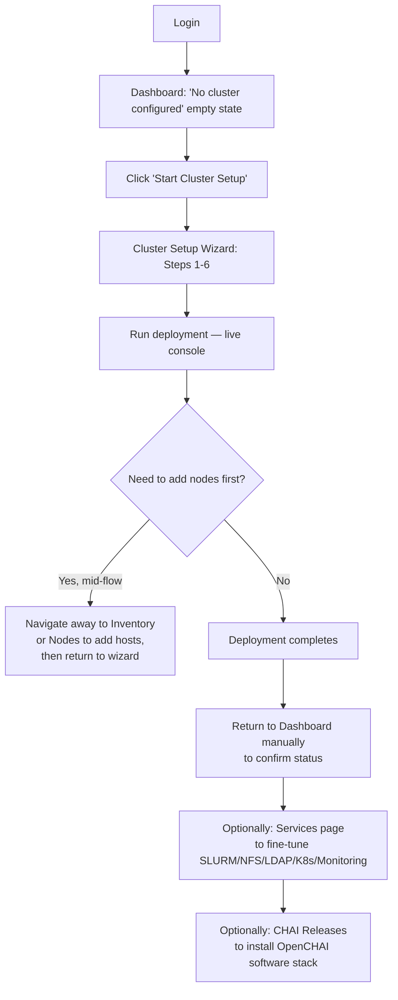

# OpenCHAI Cluster Manager — Current‑State UX / Functional Flow Map

**Purpose:** Baseline documentation of the OpenCHAI Cluster Manager GUI exactly as implemented. Nothing here is a recommendation for how the product *should* work — it is a record of how it *does* work today.

**Source analyzed:** `chai_gui/` (the actively maintained frontend — React + Vite + Tailwind, Python/Flask-style backend). Two other snapshots exist in the repo (`chai_gui_new/`, `chai_gui_bk_24jul/`) but are older, less-modified copies of the same structure — they are not separately documented.

**Stack notes (context for the design team):** React Router SPA, single persistent Navbar + Sidebar shell wrapping all authenticated pages, JWT auth stored in `localStorage`, live job output via WebSocket, toast notifications (`react-hot-toast`) for async success/error feedback, `window.confirm()` native browser dialogs for destructive-action confirmation (not custom modals).

---

## 1. Overall OpenCHAI Navigation Flow



**Entry point:** any URL under the app domain. `ProtectedRoute` checks auth state; unauthenticated users are redirected to `/login` with the originally-requested path preserved so login returns them to where they meant to go. Any unknown path (`*`) silently redirects to `/dashboard` — there is no custom 404 page.

**Global shell (present on every authenticated screen):**
- **Navbar** (fixed, never changes across pages): NSM logo · CDAC logo · OpenCHAI logo/wordmark · dark/light theme toggle · live backend health indicator (polls `/health` every 15s) · user menu (avatar, name, role, Sign Out).
- **Sidebar** (fixed left, 56-unit width): flat list of top-level modules plus one collapsible group ("Cluster Setup"). Order is fixed and not user-configurable: Dashboard → CHAI Releases → Inventory → Cluster Setup (group) → Nodes → Services → Playbooks → Deploy Logs → Backup History → Audit Log. Footer shows version string "v3.0.0 — MIT License."

---

## 2. Landing‑Page Flow (Login)

| Attribute | Detail |
|---|---|
| **Screen** | `/login` |
| **Purpose** | Authenticate against Linux/PAM system credentials (not a separate app-level user database) |
| **Main sections** | Fixed brand header (NSM + CDAC logos) · left decorative wallpaper panel (hidden below `lg` breakpoint) · right-hand credential card (OpenCHAI logo, "C‑HAI" wordmark, "Sign In" form) |
| **Form fields** | Username (plain text, autofocused on load) · Password (masked, show/hide eye toggle) |
| **User actions** | Type credentials → Submit ("Sign In" button) |
| **Validation** | Client-side: both fields required (inline red alert box: *"Username and password are required."*) before any network call |
| **Loading state** | Button becomes disabled, spinner icon + "Authenticating…" label |
| **Success outcome** | JWT + user object stored in `localStorage` → redirect to the originally-requested page, or `/dashboard` by default |
| **Failure outcome** | Red alert box with server-provided error message; password field is cleared; username retained |
| **Decision point** | None beyond credential validity — there is no "forgot password," "register," SSO, or MFA option |
| **Dependencies** | Backend PAM auth service; no dependency on any other module |
| **Special behavior** | Login page is hard-locked to light theme regardless of the user's last saved dark/light preference, and restores the saved theme automatically the moment the user leaves this screen |

**Flow:**


---

## 3. Dashboard Flow

| Attribute | Detail |
|---|---|
| **Screen** | `/dashboard` (also the default redirect target for `/` and any unknown route) |
| **Purpose** | At-a-glance cluster state + shortcut into the two most-used follow-on actions (configure cluster, view all jobs) |
| **Layout** | Single scrolling column: 4-card stat grid → 2-column summary (Cluster Overview / Recent Deployments) → full-width Node Inventory role breakdown |
| **Data fetched on load** | `clusterApi.state()` and `deployApi.jobs()` in parallel; both **auto-refresh every 10 seconds** for the life of the page |
| **Widgets** | 1. **Total Nodes** (count + compute/GPU sub-breakdown) 2. **Total GPUs** (aggregate GPU count across nodes) 3. **Cluster** (cluster name + scheduler, or "Not configured") 4. **Deploy Status** (pending/success/failed + last-deploy timestamp, color-coded) 5. **Cluster Overview** panel — key/value list of cluster config (name, head node IP, scheduler, network, fabric, SLURM/LDAP/NFS/Monitoring enabled flags) 6. **Recent Deployments** — last 5 jobs, each a link that **opens `/logs/:jobId` in a new browser tab** 7. **Node Inventory** — pill count per role (headnode/compute/gpu/storage/login/management/service), only rendered if ≥1 node exists |
| **Empty states** | No cluster configured → "No cluster configured yet" + **"Start Cluster Setup"** button → `/cluster`. No jobs yet → "No deployments yet" placeholder. No nodes → Node Inventory section is hidden entirely (not shown as empty) |
| **Error state** | Red banner at top of page; message is normalized for 401/authentication errors into a friendlier "Your session has expired…" string; other errors show raw message + "check backend is reachable" |
| **Navigation from dashboard** | "Configure" link → `/cluster` · "All jobs" link → `/logs` · "Start Cluster Setup" button (empty state only) → `/cluster` · individual job rows → `/logs/:jobId` in a **new tab** |
| **Dependencies** | Cluster Setup module (for config data) · Deploy Logs module (for job data) · Nodes/Inventory data (for node counts) |



---

## 4. Module‑by‑Module Documentation

### 4.1 Cluster Setup (`/cluster`, `/cluster/single`, `/cluster/ha`)

The largest and most complex module — a **6-step linear wizard** driven directly by the filesystem layout under `cluster_setup/` (ha/ and single/ directories → role sub-directories → `.yml` playbooks inside each).

| Attribute | Detail |
|---|---|
| **Entry points** | Sidebar → "Cluster Setup" group → "Setup Wizard" (`/cluster`, no type pre-selected) / "Single Server" (`/cluster/single`, pre-selects "single") / "HA Server Setup" (`/cluster/ha`, pre-selects "ha") — all three routes render the **same component**, only the pre-selected value in Step 1 differs |
| **Sub-modules / Steps** | 1. **Setup Type** — choose "single" or "ha" (cards, discovered from directory names) 2. **Node Role** — multi-select which role sub-directories to configure (e.g., headnode, compute, storage) 3. **Select Tasks** — checklist of individual `.yml` playbooks found inside the selected role directories, split into mandatory vs. optional, with a "select all" toggle per role and an "Advanced" reveal 4. **Variables** — auto-generated form per playbook, fields extracted live from the YAML; includes a **"Validate All"** step that must pass before the wizard allows moving on (Next is disabled until validation succeeds) 5. **Target Nodes** — pick specific nodes/groups from inventory, or type a manual Ansible `--limit` string 6. **Review & Run** — final summary of type/roles/tasks/vars/targets, dry-run toggle, verbosity 0–4 selector, live WebSocket console output, per-job status |
| **Global stepper** | Persistent horizontal step indicator; **Back** is always available (disabled only on step 1); **Next** is disabled until the current step's required condition is met (most notably Step 4's mandatory validation gate) |
| **Forms** | Step 4 dynamically renders one form per selected playbook (text/password/boolean/enum fields), with search-within-form and prev/next paging **between playbooks** inside the same step |
| **Actions** | Toggle roles/tasks/nodes · Validate variables · Run (executes each selected playbook **sequentially**, one job per playbook, polling each to a terminal state before starting the next) · Cancel (mid-run) · Download live console log |
| **Success / failure states** | Per-playbook status badge (success/failed/running) shown inline in the live console; a failed playbook does not automatically stop remaining playbooks (each proceeds independently — confirm with build team if this is intended) |
| **Dependencies** | Reads **Inventory** module data for Step 5's node/group list · reads the filesystem `cluster_setup/` directory tree directly (not a database) · execution reuses the same job/log/WebSocket infrastructure as Playbooks and CHAI Release Wizard |
| **Navigation out** | No explicit "finish" screen/redirect — user stays on Step 6 after a run completes; must manually navigate elsewhere (e.g., Dashboard or Logs) to see the deployment reflected |



---

### 4.2 Inventory Management (`/inventory`)

| Attribute | Detail |
|---|---|
| **Entry point** | Sidebar → "Inventory" |
| **Purpose** | Manage `inventory_def.txt` — the raw Ansible inventory definition file (hostname, IP, SSH user/password, group, FQDN, SSH port) used by the automation layer |
| **Screens/states** | Single-page table view with: group filter chips ("All" + one chip per distinct group) · empty state ("No nodes in inventory_def.txt yet") · loading spinner |
| **Forms / Modals** | **Add/Edit Node modal** (hostname, IP, SSH user, password, group, SSH port, FQDN — hostname is locked/uneditable once created) · **Bulk Import modal** (native OS file picker for `.csv`/`.txt`, or paste-in textarea; expects a fixed 7-field space/comma-separated format; shows per-row skip reasons on partial failure) · **Raw File modal** (read-only preview of the actual `inventory_def.txt` contents) |
| **Actions** | Add · Edit · Delete (native `window.confirm()`) · Bulk import · SSH connectivity test per row (spinner → green check / red X) · Toggle "Backup before save" (defaults ON) · View raw file · Refresh |
| **Success/failure states** | Toast notifications for every add/edit/delete/import/SSH-test outcome; bulk import shows a structured list of skipped rows with reasons rather than a single pass/fail |
| **Security note surfaced in UI** | Explicit inline messaging that passwords are Ansible-Vault-encrypted and "never shown again after saving"; edit form shows a sentinel placeholder ("unchanged — type to change") rather than the real password |
| **Dependencies** | Feeds the **Cluster Setup Wizard's** Step 5 target-node list and the **Playbooks** module's target selector · independent of the separate **Nodes** module (see pain point 6.2) |
| **Navigation out** | None explicit — this is a management-only screen, no "next step" call-to-action |

---

### 4.3 Nodes (`/nodes`)

| Attribute | Detail |
|---|---|
| **Entry point** | Sidebar → "Nodes" |
| **Purpose** | Manage a **separate** node/asset database (hostname, IP, role, BMC IP, MAC address, CPU count, RAM, GPU count/model) — this is a hardware-inventory record, distinct from the Ansible-facing `inventory_def.txt` managed under **Inventory** |
| **Forms** | Add/Edit Node modal: hostname*, IP*, role (dropdown: headnode/compute/gpu/storage/login/management/service), CPU count, RAM (GB), GPU count, GPU model (only shown if GPU count > 0), BMC IP, MAC address |
| **Actions** | Add · Edit · Delete (native confirm) · Refresh |
| **Table** | Rendered via a shared `NodeTable` component |
| **Success/failure states** | Toast per action |
| **Dependencies** | Feeds Dashboard's node-count/GPU-count widgets and role breakdown; **does not appear to share data with Inventory or the Cluster Setup Wizard's target-node picker** — see pain point 6.2 |

---

### 4.4 Services (`/services`)

| Attribute | Detail |
|---|---|
| **Entry point** | Sidebar → "Services" |
| **Purpose** | Toggle and configure cluster-wide services independent of the step-by-step Cluster Setup Wizard |
| **Layout** | Tabbed single-page form: SLURM · NFS · LDAP · Kubernetes · Monitoring |
| **Fields per tab** | SLURM: enable toggle + default partition name. NFS: enable toggle + server IP (optional, defaults to head node) + export/mount path. LDAP: enable toggle + server host + base DN. Kubernetes: enable toggle only. Monitoring: enable toggle (Prometheus+Grafana+node-exporter) + separate InfiniBand/RDMA toggle |
| **Actions** | Toggle service on/off · edit dependent fields (revealed only when the toggle is on) · Save |
| **Success/failure states** | Toast on save; if no cluster config exists yet, the entire page is replaced with an error card: *"Configure your cluster first."* (blocking — no partial use) |
| **Dependencies** | **Hard dependency on Cluster Setup** having been run at least once (reads/writes the same cluster config object) |
| **Note for design team** | This duplicates some of the same "Variables" content that appears inside the Cluster Setup Wizard's Step 4 for service-related playbooks — two different UI paths can edit overlapping configuration (see pain point 6.3) |

---

### 4.5 Playbooks (`/playbooks`)

| Attribute | Detail |
|---|---|
| **Entry point** | Sidebar → "Playbooks" |
| **Purpose** | Ad-hoc, one-off execution of **any** Ansible playbook discovered on disk, outside the guided Cluster Setup Wizard flow |
| **Layout** | Two-pane: left sidebar lists auto-discovered categories (directories) with a count badge each; right pane lists playbooks in the selected category, or the **Playbook Runner** panel once one is chosen |
| **Playbook Runner panel** | Auto-generated variable form (same field-extraction engine as the wizard) · target selector (free-text `--limit` OR dropdown of known groups/hostnames) · Dry Run toggle · Verbosity 0–4 selector · Run button (label changes to "Dry Run" when toggle is on) |
| **Execution** | On Run, launches a single job and switches the panel to an embedded `LogViewer` (live tail) in place of the form |
| **Success/failure states** | Toast on launch; live log view shows real-time status; no dedicated "done" screen — user watches the log stream directly |
| **Empty states** | "No playbook directories found" (no categories) · "No playbooks in '{category}'" · "Select a category from the sidebar" (initial state) |
| **Dependencies** | Same target-node data source as Cluster Setup Step 5 · same job/WebSocket log infrastructure as Cluster Setup and CHAI Release Wizard |
| **Navigation out** | "X" close button returns to the category/playbook list; no cross-module links |

---

### 4.6 Deploy Logs (`/logs`, `/logs/:jobId`)

| Attribute | Detail |
|---|---|
| **Entry point** | Sidebar → "Deploy Logs" — **this is the only sidebar item that opens in a new browser tab** (`target="_blank"`), so it never shows an "active" highlighted state in the sidebar even when the tab is on `/logs` |
| **Purpose** | Central, historical + live view of every executed job across all modules (Cluster Setup, Playbooks, CHAI Release Wizard all write to the same job store) |
| **Layout** | Left: scrollable job list (status icon, playbook filename, start time, line count), polled every 5 seconds, most-recent-first. Right: `LogViewer` for the selected job, or an empty placeholder ("Select a job to view logs") |
| **Actions** | Click a job to select it (`/logs/:jobId`) · Back-chevron returns to `/logs` (list-only, no selection) |
| **Empty state** | "No jobs yet" |
| **Dependencies** | Downstream consumer of jobs launched by Cluster Setup, Playbooks, and CHAI Release Wizard — no data of its own |

---

### 4.7 Backup History (`/backups`)

| Attribute | Detail |
|---|---|
| **Entry point** | Sidebar → "Backup History" |
| **Purpose** | Browse, preview, restore, or delete automatic file backups created whenever "Backup before save" was enabled during an Inventory (and presumably other) edit |
| **Layout** | Backups grouped by timestamp/snapshot; each group is a card listing affected files with size |
| **Actions** | Preview (read-only modal showing raw file content) · Restore (native confirm dialog showing source→destination paths) · Delete backup entry (native confirm) · Refresh |
| **Empty state** | "No backups yet" + explanatory subtext about when backups are created |
| **Dependencies** | Populated only as a side effect of the "Backup before save" toggle in **Inventory** (and potentially other file-editing flows) — it is a passive record, not independently triggerable from this screen |

---

### 4.8 Audit Log (`/audit`)

| Attribute | Detail |
|---|---|
| **Entry point** | Sidebar → "Audit Log" |
| **Purpose** | Chronological record of user actions across the system (node changes, cluster changes, deployments, backups), color-coded by action category |
| **Layout** | Single filterable table: Timestamp · Action (colored pill, categorized by prefix: node/cluster/deploy/backup) · Actor · Detail (raw JSON) |
| **Actions** | Filter by action text · Refresh · Clear all entries (native confirm, described as irreversible) |
| **Empty/error states** | "No audit entries found" · dedicated error card on fetch failure |
| **Dependencies** | Passive log consumer — written to by actions across Inventory, Nodes, Cluster Setup, and Backup modules |

---

### 4.9 CHAI Releases Wizard (`/releases`)

The **second-largest module**, and the only one given top billing in the sidebar (positioned directly under Dashboard, above Inventory). A single-page, **3-independent-tab** interface (explicitly redesigned away from a prior sequential Next/Back wizard, per in-code comments) — a user can jump to any tab without completing the others.

| Attribute | Detail |
|---|---|
| **Entry point** | Sidebar → "CHAI Releases" (top-priority placement) |
| **Tab 1 — OpenCHAI Packages** | Registry authentication (auth type, username, verify-SSL toggle, "Apply Auth & Load Registry" / "Skip auth and use local only" fallback) → Architecture & Distribution selection (auto-detected OS/arch shown, manual override) → Release notes (collapsible, Markdown-rendered) → Available Versions list (each tagged Local / Local Only / Remote) → Install action, gated by version selection, with live job console. Already-installed versions show a distinct "already installed — will update config only" message |
| **Tab 2 — HPC‑AI Container Tools** | Browse container registry: select a tool → load its versions → load images for a version → multi-select images ("Select all" per tool) → Download/execute action with live job console |
| **Tab 3 — Cluster Configuration** | Direct form-based editor for `group_vars/all.yml` — **gated**: only usable once a local OpenCHAI package is installed (checks for required fields: version, os_label, rhel_label, el_label, arch) · unsaved-changes guard: switching tabs or away with unsaved edits triggers a confirmation dialog ("Unsaved cluster configuration") |
| **State persistence** | Entire wizard state (active tab, auth fields, saved/skip flags) persists to `sessionStorage` so a page refresh doesn't lose progress — the **only module in the app with this behavior** |
| **Dependencies** | Tab 3 depends on Tab 1's install having completed · shares the same job/console/WebSocket infrastructure as Cluster Setup and Playbooks · writes to the same cluster config consumed by Dashboard and Services |
| **Success/failure states** | Per-action toasts + inline pill indicators (auth applied / skipped, install success banner with "Retry / Install Another" and "Continue to Cluster Configuration →" follow-on actions) |



---

## 5. User Workflows (Cross-Module)

### 5.1 Login / Authentication
Covered in Section 2. Session persists in `localStorage` across tabs/refreshes; any API call returning 401 globally clears the session and bounces the user to `/login` from wherever they were, with a toast explanation.

### 5.2 Full Cluster Creation / Deployment (primary end-to-end journey)

Note: there is no single guided path connecting Inventory → Nodes → Cluster Setup → Services → CHAI Releases. Each is reached independently via the sidebar; the wizard assumes inventory already exists.

### 5.3 Node / Inventory Management
Two parallel, non-integrated paths:
- **Inventory** (`/inventory`) — Ansible-facing (`inventory_def.txt`): SSH credentials, groups, connectivity testing.
- **Nodes** (`/nodes`) — hardware-asset-facing: role, CPU/RAM/GPU specs, BMC/MAC.

Both feed different consumers (Inventory → Cluster Setup targets & Playbooks targets; Nodes → Dashboard stat cards) with **no visible cross-link or shared identity** between a "node" in one screen and the "node" of the same hostname in the other.

### 5.4 Configuration
Cluster-level configuration is editable from **three separate places**: Cluster Setup Wizard Step 4 (per-playbook variables), Services page (service toggles/fields), and CHAI Release Wizard Tab 3 (`group_vars/all.yml` direct editor). All three ultimately affect the same underlying cluster config object.

### 5.5 Provisioning
Handled entirely inside the Cluster Setup Wizard (role/task selection + target nodes + execution) and, for ad-hoc cases, the Playbooks module.

### 5.6 Monitoring
Limited to: Dashboard's auto-refreshing stat cards (10s) and Deploy Logs' live console/job list (5s poll + WebSocket tail). There is no dedicated cluster-health, metrics, or Grafana-embedded view in this GUI, even though "Monitoring" (Prometheus/Grafana) can be *enabled as a service* from the Services page — the resulting dashboards are not surfaced inside OpenCHAI's own UI.

### 5.7 Software Management
CHAI Releases Wizard: OpenCHAI package install (Tab 1) and container image download (Tab 2).

### 5.8 Infrastructure / Resource Management
Nodes module (hardware specs) + Inventory module (connection details) + Backup History (config file version safety net) + Audit Log (change traceability).

---

## 6. Navigation Flow — Structural Notes

### 6.1 Sidebar / Menu Structure
Fixed, non-configurable, single-level except one collapsible group:
```
Dashboard
CHAI Releases
Inventory
Cluster Setup (collapsible)
  ├─ Setup Wizard
  ├─ Single Server
  └─ HA Server Setup
Nodes
Services
Playbooks
Deploy Logs   (opens new tab — never shows active state)
Backup History
Audit Log
```

### 6.2 Page-to-Page Transitions
Standard React Router client-side navigation for all internal links except **Deploy Logs**, which is deliberately forced into a new tab both from the Sidebar and from Dashboard's job list / "All jobs" link — this is the one inconsistent transition pattern in the app.

### 6.3 Back / Cancel / Continue Flows
- Cluster Setup Wizard: explicit Back/Next per step, Next gated by validation on Step 4.
- CHAI Release Wizard: tab-based, not linear; "unsaved changes" guard only on Tab 3.
- Modals (Inventory, Nodes): Cancel always available; destructive actions (delete) use native `window.confirm()`, not a styled in-app dialog.
- No breadcrumb trail anywhere in the app; the only "where am I" signal is the Sidebar's active-item highlight (or the Cluster Setup Wizard's own stepper).

### 6.4 Cross-Module Navigation
Very limited — only two hardcoded links exist from Dashboard (to `/cluster` and `/logs`). No other module links out to another module (e.g., Services never links to Cluster Setup even though they edit overlapping data; Inventory never links to Cluster Setup even though it's a hard prerequisite for the wizard's Step 5 to be useful).

---

## 7. UI/UX States — Inventory Across the App

| State | How it's generally implemented |
|---|---|
| **Initial / empty** | Per-page custom empty states with icon + short message (Dashboard, Inventory, Playbooks, Deploy Logs, Backup History, Audit Log). CHAI Release Tab 3 uses a gating message instead of a true empty state. |
| **Loading** | Centered spinning-circle spinner, consistently styled, used at both full-page and in-panel scale. |
| **Success** | `react-hot-toast` toast notifications (transient, top-of-screen) for nearly all mutating actions; some also get inline success banners (e.g., install-complete in CHAI Releases). |
| **Error** | Mix of: toast (most actions), inline red banner within the page body (Dashboard, Services, Audit Log), and full-page error replacement (Services, when no cluster config exists yet). Error message formatting is inconsistent — sometimes raw exception text, sometimes a friendlier normalized string (e.g., Dashboard's special-cased 401 message). |
| **Warning / confirmation dialogs** | Exclusively native browser `window.confirm()` for all destructive actions (delete node, delete backup, clear audit log, restore backup) — not a custom-styled modal consistent with the rest of the UI. |
| **Form validation** | Mostly client-side, inline, minimal (required-field checks); Cluster Setup Wizard Step 4 has the app's only true multi-field "Validate All" server-round-trip validation gate. |
| **Progress / status screens** | Cluster Setup Wizard's Stepper component (step 1–6 indicator) and the live WebSocket console (used identically in Cluster Setup, Playbooks, and CHAI Release Wizard) are the two recurring progress patterns. |

---

## 8. Current UX Pain Points / Complexity

1. **Duplicate, non-integrated node data models.** "Nodes" (`/nodes`) and "Inventory" (`/inventory`) both describe cluster hosts but store different attributes, are edited in different modals, and are not visibly linked — a host added in one does not appear in the other. This is very likely to confuse both new users and the design team studying "the node model."
2. **Configuration is editable from three unlinked places.** Cluster Setup Wizard Step 4, the Services page, and the CHAI Release Wizard's `group_vars/all.yml` editor can all touch overlapping cluster configuration, with no cross-navigation between them and no single "source of truth" screen.
3. **Deploy Logs breaks the navigation model.** It's the only sidebar item and only Dashboard link that force-opens a new browser tab, so it never shows the "active" sidebar highlight and behaves unlike every other transition in the app.
4. **No guided end-to-end journey.** A first-time user must independently discover that Inventory (or Nodes?) should be populated before Cluster Setup, that Services duplicates some wizard functionality, and that CHAI Releases is a separate software-installation step — nothing in the UI sequences these for them beyond the single Dashboard empty-state CTA into the wizard.
5. **Inconsistent confirmation patterns.** Destructive actions use native unstyled browser `confirm()` dialogs while everything else in the app uses a custom design system — a jarring visual/interaction break.
6. **Inconsistent error presentation.** Errors surface as toast, inline banner, or full-page block depending on the screen, with inconsistent message formatting (raw vs. normalized).
7. **No breadcrumbs or "you are here" beyond the sidebar highlight** — long flows like the two wizards have no higher-level orientation showing which module/workflow the user is inside relative to the rest of the app.
8. **Cluster Setup Wizard has no explicit "done" state.** After a run finishes, the user remains on Step 6 with no clear next action or automatic redirect — they must know to go check the Dashboard or Logs themselves.
9. **Monitoring is a checkbox, not a view.** "Monitoring" can be enabled as a deployed *service* (Prometheus/Grafana) from the Services tab, but the resulting dashboards/metrics are never surfaced anywhere inside OpenCHAI's own GUI — a naming/expectation mismatch for anyone reading "Monitoring" in the sidebar-adjacent Services tab.
10. **Session persistence is inconsistent across modules.** Only the CHAI Release Wizard persists in-progress state to `sessionStorage`; the Cluster Setup Wizard and Playbooks runner do not — a refresh mid-wizard on Cluster Setup loses all progress, while the same refresh on CHAI Releases does not.
11. **Two visually near-identical "Add/Edit Node" modals** (Inventory's and Nodes') with different fields reinforce pain point #1 and increase the chance of a design/dev team conflating them during redesign.

## 9. Potential Areas for UI/UX Optimization
*(Flagged for the design team's own judgment — not a redesign prescription.)*
- Unify or clearly differentiate the Inventory vs. Nodes data models with a single navigable "node" identity.
- Establish one canonical place to view/edit cluster configuration, with the other entry points deep-linking into it rather than each owning a separate editor.
- Standardize confirmation dialogs and error-display patterns into the existing design system components instead of native browser dialogs.
- Introduce a lightweight breadcrumb or "workflow" affordance for multi-step processes (both wizards) so orientation doesn't rely solely on the sidebar.
- Define and surface an explicit "setup complete" state at the end of the Cluster Setup Wizard, with a clear next-step CTA (e.g., to Services or Dashboard).
- Reconsider the Deploy Logs "always new tab" behavior for consistency with the rest of the navigation model, or make the exception intentional and clearly signposted.
- Decide on a consistent session-persistence policy across all multi-step flows (either all persist to `sessionStorage`, or none do, with a rationale for any exception).
- Consider surfacing actual monitoring data/links (e.g., a Grafana deep link) once the Monitoring service is enabled, rather than leaving it as a configuration toggle only.

## 10. Recommended Next Steps for the UI/UX Design Team
1. Validate this document against a live walkthrough of the running app with the product owner, to confirm nothing implemented-but-edge-case was missed (this map is based on static code analysis, not a live click-through).
2. Prioritize the pain points in Section 8 by user impact and engineering cost before proposing redesign concepts.
3. Design a single, canonical "cluster configuration" information architecture that reconciles Section 8, item 2.
4. Design a unified node/inventory model proposal (Section 8, item 1) and validate it against both the Ansible-facing and hardware-asset-facing data requirements before committing to a merge.
5. Propose a consistent confirmation/error/empty-state component library and retrofit plan.
6. Map a proposed "golden path" onboarding journey (login → inventory → cluster setup → services → releases → monitoring) as a north star for future navigation redesign, using this document's module list as the complete scope to preserve.
