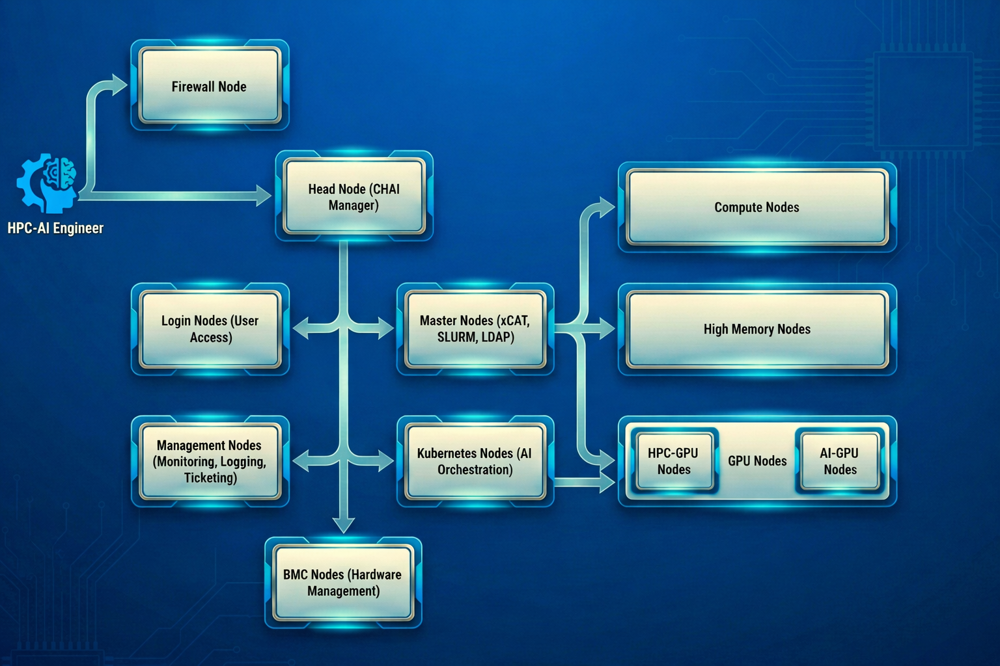

Architecture Overview
=====================
OpenCHAI is designed as a centralized cluster management and automation platform for large-scale HPC and AI environments. The architecture follows a control-plane–driven model, where all cluster components are provisioned, configured, and managed from a single OpenCHAI Manager (Head Node). This approach ensures operational consistency, scalability, and repeatability across heterogeneous infrastructure.

The architecture separates responsibilities across clearly defined node roles, enabling modular deployment, independent scaling, and high availability.

Architecture Components
=======================

This section provides a component-wise overview of the OpenCHAI cluster architecture. Each component plays a well-defined role in enabling scalable, secure, and automated HPC-AI cluster operations.

--------------------------------
1. OpenCHAI Manager (Head Node)
--------------------------------

The OpenCHAI Manager acts as the primary control plane for the entire cluster. It is responsible for:

- End-to-end cluster provisioning and configuration
- Centralized execution of automation workflows
- Orchestration of service node deployments
- Configuration management across all cluster roles

The manager leverages **Ansible**, **Python**, and **shell-based automation** to enforce infrastructure-as-code principles and maintain a consistent and reproducible cluster state.

----------------
2. Firewall Node
----------------

The firewall node provides perimeter security and network segmentation for the cluster. It controls ingress and egress traffic between external networks and internal cluster services.

.. note::

   The firewall node operates as an external infrastructure component and is not provisioned or managed by OpenCHAI.

------------------------------------
3. Master Nodes (xCAT, SLURM, LDAP)
------------------------------------

Master nodes host the core control services required for orchestration, scheduling, and authentication:

- **xCAT** for node provisioning and lifecycle management
- **SLURM** for workload scheduling and resource allocation
- **LDAP** for centralized authentication and authorization

These nodes form the backbone of the cluster control plane and are typically deployed in **high-availability (HA)** configurations.

---------------
4. Compute Nodes
---------------

Compute nodes provide the primary execution environment for HPC workloads. They are dynamically provisioned and configured by OpenCHAI based on predefined cluster profiles.

Key characteristics include:

- Stateless compute execution
- Centrally managed operating system images
- Scheduler-controlled resource allocation

--------------------
5. High-Memory Nodes
--------------------

High-memory nodes are specialized compute resources designed for memory-intensive workloads such as:

- Large-scale simulations
- In-memory analytics
- AI model training

These nodes integrate seamlessly with the same scheduling and orchestration mechanisms as standard compute nodes.

------------------------------------
6. GPU Nodes (HPC-GPU and AI-GPU)
------------------------------------

GPU nodes provide accelerator-based compute resources optimized for high-performance and AI workloads:

- **HPC-GPU Nodes** for simulation and scientific computing
- **AI-GPU Nodes** for deep learning and data-intensive workloads

OpenCHAI manages GPU node provisioning, driver configuration, and scheduler integration as part of the standard cluster lifecycle.

-------------------------------------
7. Kubernetes Nodes (AI Orchestration)
-------------------------------------

Kubernetes nodes enable container orchestration for AI and cloud-native workloads. This layer supports:

- Containerized AI pipelines
- Hybrid HPC-AI workloads
- Integration with modern DevOps and MLOps workflows

Kubernetes is deployed and managed as a first-class component within the OpenCHAI ecosystem.

--------------------------
8. Login Nodes (User Access)
--------------------------

Login nodes provide controlled user access to the cluster environment. They act as secure entry points for users to:

- Submit jobs
- Manage workflows
- Access shared resources

These nodes are isolated from compute execution to enhance system security and operational stability.

---------------------------------------
9. Management Nodes (Monitoring, Ticketing)
---------------------------------------

Management nodes host operational and observability services, including:

- Cluster monitoring and health checks
- Alerting and event tracking
- Operational support and ticketing integrations

This separation ensures that management workloads do not interfere with compute or scheduling operations.

----------------------------------
10. BMC Nodes (Hardware Management)
----------------------------------

BMC (Baseboard Management Controller) nodes enable out-of-band hardware management, including:

- Power control
- Hardware health monitoring
- Remote troubleshooting

OpenCHAI integrates with BMC interfaces to support automated provisioning, recovery, and lifecycle management workflows.

-----------------------
Architectural Benefits
-----------------------

The OpenCHAI architecture delivers the following enterprise-grade benefits:

- Centralized control with distributed execution
- Modular, role-based cluster design
- Scalability across HPC and AI workloads
- Production-ready enterprise architecture
- Reduced operational overhead and deployment complexity

