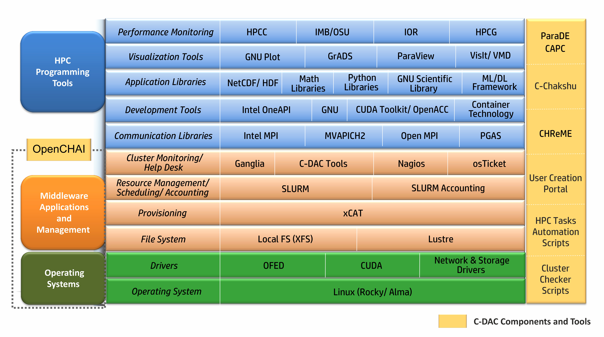

HPC Software Stack
=================

The HPC Software Stack defines the layered software ecosystem required to build,
operate, and optimize High Performance Computing (HPC) and AI-enabled clusters.
This stack integrates operating systems, drivers, middleware, resource management,
programming environments, and user-facing tools into a cohesive and scalable platform.

OpenCHAI automates the deployment, configuration, and lifecycle management of
this complete software stack across heterogeneous cluster environments.

Architecture Layers
-------------------

The HPC software stack is organized into clearly defined layers, each serving
a specific role in the overall system architecture.

Operating System Layer
~~~~~~~~~~~~~~~~~~~~~~

This layer provides the foundational runtime environment for all cluster services.

- Enterprise Linux distributions (Rocky Linux / AlmaLinux)
- Optimized kernel configurations for HPC and AI workloads
- Security and system-level tuning

Drivers Layer
~~~~~~~~~~~~~

Hardware enablement and performance acceleration are handled at this layer.

- OFED for high-performance interconnects
- CUDA for GPU acceleration
- Network and storage drivers

File System Layer
~~~~~~~~~~~~~~~~~

Provides persistent and high-throughput storage for workloads and user data.

- Local file systems (XFS)
- Parallel file systems (Lustre)

Provisioning Layer
~~~~~~~~~~~~~~~~~~

Responsible for bare-metal provisioning and node lifecycle management.

- Automated node discovery and deployment
- Image-based provisioning
- Firmware and OS consistency enforcement

Resource Management, Scheduling, and Accounting
~~~~~~~~~~~~~~~~~~~~~~~~~~~~~~~~~~~~~~~~~~~~~~~~

Ensures efficient utilization of cluster resources.

- Job scheduling and workload orchestration
- Resource allocation and policy enforcement
- Usage accounting and reporting

Cluster Monitoring and Help Desk
~~~~~~~~~~~~~~~~~~~~~~~~~~~~~~~~

Provides operational visibility and support capabilities.

- Cluster health and performance monitoring
- Alerting and diagnostics
- Operational support and ticketing systems

Communication Libraries
~~~~~~~~~~~~~~~~~~~~~~~

Enables high-performance parallel communication.

- MPI implementations (Intel MPI, MVAPICH2, Open MPI)
- PGAS programming models

Development Tools
~~~~~~~~~~~~~~~~~

Supports application development and optimization.

- Compiler toolchains
- Accelerator programming frameworks
- Container technologies

Application Libraries
~~~~~~~~~~~~~~~~~~~~~

Provides reusable scientific, mathematical, and AI components.

- Scientific data libraries
- Mathematical and numerical libraries
- Python and GNU scientific ecosystems
- Machine learning and deep learning frameworks

Visualization Tools
~~~~~~~~~~~~~~~~~~~

Enables post-processing and interactive data analysis.

- Plotting and scientific visualization tools
- 3D and parallel visualization platforms

Performance Monitoring
~~~~~~~~~~~~~~~~~~~~~~

Used for benchmarking, profiling, and performance analysis.

- HPC benchmarks
- I/O and communication performance tools
- System-level performance analytics

User-Facing Platforms and Portals
---------------------------------

The software stack integrates user-accessible platforms to simplify
cluster interaction and administration.

- User access and account management portals
- Workflow automation tools
- Cluster validation and health-check utilities

Integration with OpenCHAI
-------------------------

OpenCHAI orchestrates this entire software stack using
infrastructure-as-code principles, ensuring:

- Consistent deployments across environments
- Reproducible and auditable configurations
- Scalable support for HPC, GPU, and AI workloads
- Reduced operational complexity

This layered approach enables OpenCHAI to support
enterprise-grade HPC and AI platforms with flexibility,
reliability, and performance.
